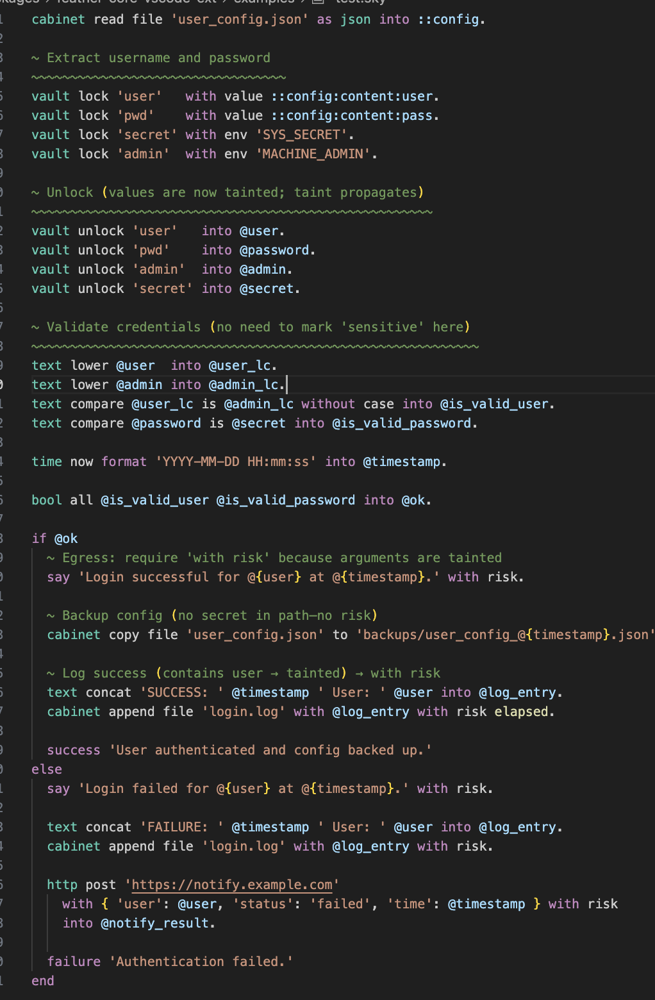

  

# What is Nekonomicon?

It is a human readable language designed to be embedded in applications or used as a standalone, elegant, and fast scripting interface. It is written in Rust.

# Why use Nekonomicon?

Nekonomicon's strength lies in its core architectural principles and design choices that emphasize clarity, safety, and composability. The language enforces strong type safety and includes secure-by-default features that protect users from common scripting pitfalls. Its readability-first rules make scripts accessible and maintainable, even for those unfamiliar with nekonomicon.

While this design approach makes nekonomicon scripts harder to write quickly, it makes them much easier to read, understand, and maintain over time. This balance ensures that nekonomicon is a reliable tool for automation and scripting tasks, fostering confidence and reducing errors.

Key principles behind nekonomicon's design include:

- Clear and explicit logic that prioritizes understanding over brevity
- Strong type safety to catch errors early
- Secure-by-default operations to enhance script safety
- Composability that encourages building complex workflows from simple, understandable parts
- Readability-first rules that make scripts approachable for all users

# Goals

To create an elegant, fast and reliable library and REPL to make scripting easy, intuitive and simple. Even if nekonomicon might not be able to do anything, the goal is to make everything in the best possible way

# Demo

# Performance Philosophy

nekonomicon is not designed to compete with low-level scripting engines or compiled languages in raw speed. Instead, it prioritizes clarity, safety, and composability — values that matter most in real-world automation and tooling workflows.

We deliberately accept a slight performance tradeoff to provide:

- Explicit and readable logic
- Secure-by-default operations (`vault`, `safe`, `elevated`)
- Predictable behavior with minimal surprises
- Easier onboarding for non-programmers and junior developers

nekonomicon's goal is not to win benchmarks. And at the end of the day, when you need raw control or edge-case performance, you can always fall back to native script execution using the script module.

# Golden Rules

nekonomicon is designed around a few core principles that shape every part of its syntax and behavior:

1. **Minimal symbols** — use as few special characters as possible. The goal is readability, not cryptic shorthand.
2. **English-like syntax** — commands should be as close to plain English as possible.
3. **Elegant, simple flow** — scripts should be easy to follow, but we do not cut corners for the sake of brevity.
4. **Cross-platform by default** — a single script should work on any machine without modification.
5. **Clarity and speed of reading** — code should be clear and effortless to understand at a glance.
6. **Consistency over conciseness** — prefer consistent patterns even if they are slightly longer to write.
7. **Composability over complexity** — build small, understandable instructions that can be combined rather than overly complex one-liners.

nekonomicon should feel intuitive: you can pick it up without memorizing a manual. It is designed to solve 80% of everyday tasks cleanly. When it cannot, you can gracefully fall back to native `script` commands without breaking your flow.

# Documentation

The documentation is available in the docs folder. see nekonomicon [docs](./docs/index.md)

# Contributions

Contributions are welcome!
All contributions will be reviewed and must be approved by the project maintainer before being merged.
